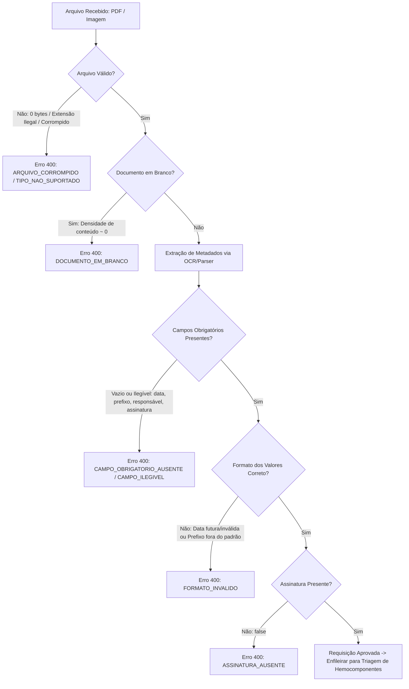

# Rota Vital — Especificação e Implementação da Validação de Entrada
**Responsável:** Caio  
**Módulo:** Ingestão de Documentos e Validação de Entrada  
**Projeto:** Rota Vital (Sistema de Gestão e Distribuição de Hemocomponentes)  
**Instituição:** CESAR School — ADS, 3º Período  
**Formato de Entrega:** Documentação Técnica, Implementação Java e Especificação OpenAPI (`.md`)

---

## 1. Visão Geral e Contexto

No ecossistema do **Rota Vital**, hospitais e unidades de pronto-atendimento solicitam bolsas de sangue e hemocomponentes enviando formulários de requisição transfusional (em formato físico escaneado ou arquivo digital). 

Antes que qualquer requisição seja inserida na fila de distribuição de estoque (processada em C e Java), ela deve ser auditada pela **Camada de Validação de Entrada**. O propósito deste módulo é blindar o sistema contra arquivos corrompidos, extensões forjadas, documentos em branco ou metadados inconsistentes, garantindo conformidade sanitária e rastreabilidade jurídica.

O pipeline opera em dois estágios complementares:
1. **Validação Física do Arquivo Binário:** Inspeciona integridade, limites de tamanho, *magic bytes* no cabeçalho e detecção de folhas em branco.
2. **Validação Semântica dos Metadados Extraídos:** Audita a presença dos 4 campos mandatórios (`data`, `prefixoAgencia`, `nomeResponsavel`, `assinaturaPresente`), aplicando regras de padrão de datas, expressões regulares de prefixo institucional e detecção de rubrica/assinatura.

Qualquer violação resulta na interrupção do fluxo com retorno HTTP **`400 Bad Request`** e detalhamento específico de cada campo com erro.

---

## 2. Diagrama do Fluxo de Validação



---

## 3. Especificação das Regras de Validação

### 3.1. Validação de Formato e Integridade Física do Arquivo

| Critério | Regra Técnica | Tratamento em caso de Falha |
| :--- | :--- | :--- |
| **Formatos Homologados** | Apenas `application/pdf`, `image/jpeg` (`.jpg`, `.jpeg`) e `image/png`. | Rejeição com código `TIPO_ARQUIVO_NAO_SUPORTADO`. |
| **Assinatura Binária (*Magic Bytes*)** | Inspeção dos primeiros bytes do arquivo para neutralizar extensões forjadas:<br>• **PDF**: `%PDF-` (`0x25 0x50 0x44 0x46`)<br>• **PNG**: `0x89 0x50 0x4E 0x47 0x0D 0x0A 0x1A 0x0A`<br>• **JPEG**: `0xFF 0xD8 0xFF` | Rejeição com código `ARQUIVO_CORROMPIDO` ou `CABECALHO_INVALIDO`. |
| **Arquivo Vazio / Limites de Tamanho** | Tamanho deve ser $\ge$ 1.024 bytes (1 KB) e $\le$ 10.485.760 bytes (10 MB). Arquivos com 0 bytes são recusados na pré-validação. | Rejeição com código `ARQUIVO_VAZIO` ou `TAMANHO_EXCEDIDO`. |
| **Detecção de Folha em Branco** | Cálculo da razão de pixels úteis (tinta/grafia) em relação à área total rasterizada. Se mais de 99,6% dos pixels forem brancos/transparentes, o documento é classificado como em branco. | Rejeição com código `DOCUMENTO_EM_BRANCO`. |

---

### 3.2. Validação de Campos Obrigatórios Extraídos

Após o OCR, o conjunto de dados extraído deve conter os quatro atributos mínimos regulamentares:

1. **`data`**: Data da emissão da requisição;
2. **`prefixoAgencia`**: Prefixo identificador da unidade solicitante (agência transfusional, hospital ou hemonúcleo);
3. **`nomeResponsavel`**: Nome do médico ou responsável técnico emissor;
4. **`assinaturaPresente`**: Indicador de detecção de rubrica/carimbo/assinatura física ou eletrônica.

#### Critérios de Erro por Ausência ou Ilegibilidade:
* Valor nulo (`null`), string vazia (`""`) ou formada apenas por espaços.
* Identificadores de falha do extrator de texto: `"[ILEGIVEL]"`, `"[UNREADABLE]"`, `"[ERRO_LEITURA]"` ou `"[DESCONHECIDO]"`.
* Ausência de assinatura (`assinaturaPresente == false` ou `null`).

---

### 3.3. Checagem de Formato dos Valores e Regras de Negócio

| Campo | Padrão Esperado | Regra de Negócio | Código de Erro |
| :--- | :--- | :--- | :--- |
| **`data`** | Padrão ISO-8601 (`YYYY-MM-DD`) ou brasileiro (`DD/MM/YYYY`). | • Deve ser uma data real no calendário (ex: `31/02/2026` é inválido).<br>• **Não pode ser futura** ($data \le dataAtual$).<br>• Não pode ter sido emitida há mais de 30 dias (limite de validade clínica da requisição). | `DATA_FORMATO_INVALIDO`<br>`DATA_FUTURA_INVALIDA`<br>`DATA_EXPIRADA` |
| **`prefixoAgencia`** | Expressão Regular:<br>`^[A-Z]{2,4}-[0-9]{3,5}$`<br>*(Ex: `AG-1002`, `HEMO-014`)* | • Deve iniciar com 2 a 4 caracteres alfabéticos maiúsculos, hífen e de 3 a 5 dígitos numéricos. | `PREFIXO_AGENCIA_INVALIDO` |
| **`nomeResponsavel`** | Expressão Regular:<br>`^[A-Za-zÀ-ÿ\s\.\-']{3,100}$` | • Mínimo de 3 caracteres.<br>• Rejeita caracteres espúrios de ruído de escaneamento (`1234`, `@#$`). | `NOME_RESPONSAVEL_INVALIDO` |
| **`assinaturaPresente`** | Booleano estrito `true`. | • Não pode ser nulo ou falso. Guias sem assinatura não possuem validade operacional. | `ASSINATURA_AUSENTE` |

---

## 4. Implementação em Java

A implementação foi construída de forma desacoplada, utilizando Java puro com compatibilidade universal (Java 8 a 25), pronta tanto para uso direto nas classes de AED quanto para integração com frameworks REST como Spring Boot / Quarkus / Micronaut.

### 4.1. Exceção Customizada: `DocumentoInvalidoException`

A exceção armazena a lista com **todos os campos específicos que falharam**, com mensagens descritivas para cada atributo problemático.

```java
package br.org.cesar.rotavital.validacao.exception;

import java.util.ArrayList;
import java.util.Collections;
import java.util.List;

/**
 * Exceção lançada quando a validação de entrada de um documento falha.
 * Contém a lista detalhada de cada campo inválido e o motivo da rejeição.
 */
public class DocumentoInvalidoException extends RuntimeException {

    private final List<DetalheErroCampo> erros;

    public DocumentoInvalidoException(String mensagem) {
        super(mensagem);
        this.erros = new ArrayList<>();
    }

    public DocumentoInvalidoException(String campo, String codigo, String motivo, Object valorRecebido) {
        super(String.format("Falha no campo '%s': %s", campo, motivo));
        this.erros = new ArrayList<>();
        this.erros.add(new DetalheErroCampo(campo, codigo, motivo, valorRecebido));
    }

    public DocumentoInvalidoException(String mensagemGeral, List<DetalheErroCampo> erros) {
        super(mensagemGeral);
        this.erros = erros != null ? new ArrayList<>(erros) : new ArrayList<>();
    }

    public List<DetalheErroCampo> getErros() {
        return Collections.unmodifiableList(erros);
    }

    public static class DetalheErroCampo {
        private final String campo;
        private final String codigo;
        private final String mensagem;
        private final Object valorRecebido;

        public DetalheErroCampo(String campo, String codigo, String mensagem, Object valorRecebido) {
            this.campo = campo;
            this.codigo = codigo;
            this.mensagem = mensagem;
            this.valorRecebido = valorRecebido;
        }

        public String getCampo() { return campo; }
        public String getCodigo() { return codigo; }
        public String getMensagem() { return mensagem; }
        public Object getValorRecebido() { return valorRecebido; }

        @Override
        public String toString() {
            return String.format("[%s] Campo '%s': %s (Recebido: '%s')", codigo, campo, mensagem, valorRecebido);
        }
    }
}
```

---

### 4.2. Classe de Dados: `DadosRequisicao`

```java
package br.org.cesar.rotavital.validacao.model;

/**
 * Representa os dados extraídos da requisição de hemocomponentes.
 */
public class DadosRequisicao {
    private String data;
    private String prefixoAgencia;
    private String nomeResponsavel;
    private Boolean assinaturaPresente;

    public DadosRequisicao() {}

    public DadosRequisicao(String data, String prefixoAgencia, String nomeResponsavel, Boolean assinaturaPresente) {
        this.data = data;
        this.prefixoAgencia = prefixoAgencia;
        this.nomeResponsavel = nomeResponsavel;
        this.assinaturaPresente = assinaturaPresente;
    }

    public String getData() { return data; }
    public void setData(String data) { this.data = data; }

    public String getPrefixoAgencia() { return prefixoAgencia; }
    public void setPrefixoAgencia(String prefixoAgencia) { this.prefixoAgencia = prefixoAgencia; }

    public String getNomeResponsavel() { return nomeResponsavel; }
    public void setNomeResponsavel(String nomeResponsavel) { this.nomeResponsavel = nomeResponsavel; }

    public Boolean getAssinaturaPresente() { return assinaturaPresente; }
    public void setAssinaturaPresente(Boolean assinaturaPresente) { this.assinaturaPresente = assinaturaPresente; }
}
```

---

### 4.3. Motor de Validação: `ValidadorEntradaDocumento`

```java
package br.org.cesar.rotavital.validacao.service;

import br.org.cesar.rotavital.validacao.exception.DocumentoInvalidoException;
import br.org.cesar.rotavital.validacao.exception.DocumentoInvalidoException.DetalheErroCampo;
import br.org.cesar.rotavital.validacao.model.DadosRequisicao;

import java.time.LocalDate;
import java.time.format.DateTimeFormatter;
import java.time.format.DateTimeParseException;
import java.util.ArrayList;
import java.util.List;
import java.util.regex.Pattern;

public class ValidadorEntradaDocumento {

    private static final Pattern PREFIXO_AGENCIA_REGEX = Pattern.compile("^[A-Z]{2,4}-[0-9]{3,5}$");
    private static final Pattern NOME_RESPONSAVEL_REGEX = Pattern.compile("^[A-Za-zÀ-ÿ\\s\\.\\-']{3,100}$");
    private static final DateTimeFormatter FORMATO_ISO = DateTimeFormatter.ofPattern("yyyy-MM-dd");
    private static final DateTimeFormatter FORMATO_BR = DateTimeFormatter.ofPattern("dd/MM/yyyy");

    /**
     * Valida os bytes físicos do arquivo (integridade, tamanho e magic bytes).
     */
    public void validarArquivo(byte[] bytesArquivo, String nomeArquivo) {
        List<DetalheErroCampo> erros = new ArrayList<>();

        if (bytesArquivo == null || bytesArquivo.length == 0) {
            throw new DocumentoInvalidoException("arquivo", "ARQUIVO_VAZIO",
                    "O arquivo submetido está vazio ou possui 0 bytes.", 0);
        }

        if (bytesArquivo.length < 1024) {
            erros.add(new DetalheErroCampo("arquivo", "ARQUIVO_CORROMPIDO",
                    "Arquivo corrompido ou incompleto: tamanho inferior a 1 KB.", bytesArquivo.length));
        }

        if (bytesArquivo.length > 10 * 1024 * 1024) {
            erros.add(new DetalheErroCampo("arquivo", "TAMANHO_EXCEDIDO",
                    "O tamanho do arquivo excede o limite máximo permitido de 10 MB.", bytesArquivo.length));
        }

        // Inspeção de Magic Bytes
        if (bytesArquivo.length >= 4) {
            boolean isPdf = bytesArquivo[0] == 0x25 && bytesArquivo[1] == 0x50 
                         && bytesArquivo[2] == 0x44 && bytesArquivo[3] == 0x46; // %PDF
            boolean isPng = bytesArquivo.length >= 8 && (bytesArquivo[0] & 0xFF) == 0x89 
                         && bytesArquivo[1] == 0x50 && bytesArquivo[2] == 0x4E && bytesArquivo[3] == 0x47;
            boolean isJpeg = (bytesArquivo[0] & 0xFF) == 0xFF && (bytesArquivo[1] & 0xFF) == 0xD8 
                          && (bytesArquivo[2] & 0xFF) == 0xFF;

            if (!isPdf && !isPng && !isJpeg) {
                erros.add(new DetalheErroCampo("arquivo", "TIPO_ARQUIVO_NAO_SUPORTADO",
                        "Formato não suportado. O documento deve ser um PDF ou imagem JPEG/PNG válida.", nomeArquivo));
            }
        }

        if (!erros.isEmpty()) {
            throw new DocumentoInvalidoException("Arquivo rejeitado na análise física/binária.", erros);
        }
    }

    /**
     * Valida os metadados extraídos da guia médica.
     */
    public void validarMetadados(DadosRequisicao dados) {
        List<DetalheErroCampo> erros = new ArrayList<>();

        if (dados == null) {
            throw new DocumentoInvalidoException("requisicao", "DADOS_NULOS",
                    "Os dados da requisição não foram informados.", null);
        }

        // 1. Data
        if (isVazioOuIlegivel(dados.getData())) {
            erros.add(new DetalheErroCampo("data", "CAMPO_OBRIGATORIO_AUSENTE",
                    "O campo 'data' é obrigatório e está ausente ou ilegível.", dados.getData()));
        } else {
            LocalDate dataConvertida = parseData(dados.getData());
            if (dataConvertida == null) {
                erros.add(new DetalheErroCampo("data", "DATA_FORMATO_INVALIDO",
                        "O campo 'data' possui formato inválido. Use 'YYYY-MM-DD' ou 'DD/MM/YYYY'.", dados.getData()));
            } else if (dataConvertida.isAfter(LocalDate.now())) {
                erros.add(new DetalheErroCampo("data", "DATA_FUTURA_INVALIDA",
                        "A data do documento não pode ser posterior à data atual.", dados.getData()));
            } else if (dataConvertida.isBefore(LocalDate.now().minusDays(30))) {
                erros.add(new DetalheErroCampo("data", "DATA_EXPIRADA",
                        "A requisição foi emitida há mais de 30 dias e está expirada para uso clínico.", dados.getData()));
            }
        }

        // 2. Prefixo da Agência
        if (isVazioOuIlegivel(dados.getPrefixoAgencia())) {
            erros.add(new DetalheErroCampo("prefixoAgencia", "CAMPO_OBRIGATORIO_AUSENTE",
                    "O campo 'prefixoAgencia' é obrigatório e está ausente ou ilegível.", dados.getPrefixoAgencia()));
        } else if (!PREFIXO_AGENCIA_REGEX.matcher(dados.getPrefixoAgencia().trim().toUpperCase()).matches()) {
            erros.add(new DetalheErroCampo("prefixoAgencia", "PREFIXO_AGENCIA_INVALIDO",
                    "O campo 'prefixoAgencia' deve seguir o formato regulatório '[SIGLA]-[NUMERO]' (Ex: 'AG-1002' ou 'HEMO-014').",
                    dados.getPrefixoAgencia()));
        }

        // 3. Nome do Responsável
        if (isVazioOuIlegivel(dados.getNomeResponsavel())) {
            erros.add(new DetalheErroCampo("nomeResponsavel", "CAMPO_OBRIGATORIO_AUSENTE",
                    "O campo 'nomeResponsavel' é obrigatório e está ausente ou ilegível.", dados.getNomeResponsavel()));
        } else if (!NOME_RESPONSAVEL_REGEX.matcher(dados.getNomeResponsavel().trim()).matches()) {
            erros.add(new DetalheErroCampo("nomeResponsavel", "NOME_RESPONSAVEL_INVALIDO",
                    "O campo 'nomeResponsavel' deve conter entre 3 e 100 caracteres alfabéticos válidos.", dados.getNomeResponsavel()));
        }

        // 4. Assinatura Presente
        if (dados.getAssinaturaPresente() == null || !dados.getAssinaturaPresente()) {
            erros.add(new DetalheErroCampo("assinaturaPresente", "ASSINATURA_AUSENTE",
                    "A assinatura física ou digital do responsável técnico não foi localizada no documento.", false));
        }

        if (!erros.isEmpty()) {
            throw new DocumentoInvalidoException("Falha na validação dos campos obrigatórios da requisição.", erros);
        }
    }

    private boolean isVazioOuIlegivel(String valor) {
        if (valor == null || valor.trim().isEmpty()) return true;
        String limpo = valor.trim().toUpperCase();
        return limpo.equals("[ILEGIVEL]") || limpo.equals("[UNREADABLE]") 
            || limpo.equals("[ERRO_LEITURA]") || limpo.equals("[DESCONHECIDO]");
    }

    private LocalDate parseData(String dataTexto) {
        try {
            return LocalDate.parse(dataTexto.trim(), FORMATO_ISO);
        } catch (DateTimeParseException e1) {
            try {
                return LocalDate.parse(dataTexto.trim(), FORMATO_BR);
            } catch (DateTimeParseException e2) {
                return null;
            }
        }
    }
}
```

---

## 5. Definição do Status HTTP de Retorno: `400 Bad Request`

O status HTTP **`400 Bad Request`** é o código regulamentado pela RFC 9110 para indicar que a solicitação enviada pelo cliente possui erros de sintaxe, campos inválidos ou dados corrompidos.

### Justificativas Técnicas:
1. **Origem do Problema no Cliente:** A falha decorre diretamente do envio de um documento incompatível, truncado ou com campos ilegíveis pelo emissor.
2. **Consistência:** Em vez de retornar um erro 500 (falha do servidor) ou códigos genéricos, o 400 deixa evidente que a correção deve ser realizada na origem (digitalizar novamente a guia, carimbar ou assinar).
3. **Payload Padronizado:** O retorno é formatado em JSON contendo:
   - `timestamp`: Momento exato da rejeição.
   - `status`: 400.
   - `erro`: "Bad Request".
   - `mensagem`: Resumo do motivo geral da reprovação.
   - `path`: Endpoint acessado.
   - `erros`: Vetor detalhado com cada campo afetado.

---

## 6. Especificação OpenAPI 3.0 (Swagger) com Exemplos Reais

```yaml
openapi: 3.0.3
info:
  title: Rota Vital — API de Ingestão e Validação de Documentos
  description: Serviço de validação de entrada de guias de requisição de hemocomponentes.
  version: 1.0.0
paths:
  /api/v1/documentos/validar:
    post:
      tags:
        - Validação de Entrada
      summary: Valida formato do arquivo e campos obrigatórios da requisição
      description: |
        Recebe a guia digitalizada (PDF ou imagem) e os metadados extraídos para verificar
        conformidade binária, presença dos campos obrigatórios, formato dos dados e assinatura.
      operationId: validarDocumentoEntrada
      requestBody:
        required: true
        content:
          multipart/form-data:
            schema:
              type: object
              required:
                - arquivo
                - data
                - prefixoAgencia
                - nomeResponsavel
                - assinaturaPresente
              properties:
                arquivo:
                  type: string
                  format: binary
                  description: Arquivo PDF, JPEG ou PNG da requisição.
                data:
                  type: string
                  example: "2026-09-23"
                  description: Data de emissão (YYYY-MM-DD ou DD/MM/YYYY).
                prefixoAgencia:
                  type: string
                  example: "AG-1002"
                  description: Código regulatório da unidade de saúde (ex: AG-XXXX).
                nomeResponsavel:
                  type: string
                  example: "Dr. Carlos Eduardo Menezes"
                  description: Nome completo do profissional requisitante.
                assinaturaPresente:
                  type: boolean
                  example: true
                  description: Confirmação visual de assinatura/carimbo no documento.
      responses:
        '200':
          description: Documento aprovado na validação de entrada.
          content:
            application/json:
              schema:
                $ref: '#/components/schemas/ValidacaoSucessoResponse'
              example:
                status: "APROVADO"
                mensagem: "Documento e metadados validados com sucesso."
                protocolo: "PROT-20260923-8841"
                dadosValidados:
                  data: "2026-09-23"
                  prefixoAgencia: "AG-1002"
                  nomeResponsavel: "Dr. Carlos Eduardo Menezes"
                  assinaturaConfirmada: true

        '400':
          description: Erro de validação de entrada (arquivo corrompido, campos ausentes ou formato inválido).
          content:
            application/json:
              schema:
                $ref: '#/components/schemas/ErroValidacaoResponse'
              examples:
                TipoArquivoNaoSuportado:
                  summary: 1. Extensão ou MIME inválido (ex: arquivo executável renomeado)
                  value:
                    timestamp: "2026-09-23T22:30:10Z"
                    status: 400
                    erro: "Bad Request"
                    mensagem: "Arquivo rejeitado na análise física/binária."
                    path: "/api/v1/documentos/validar"
                    erros:
                      - campo: "arquivo"
                        codigo: "TIPO_ARQUIVO_NAO_SUPORTADO"
                        mensagem: "Formato não suportado. O documento deve ser um PDF ou imagem JPEG/PNG válida."
                        valorRecebido: "software_malicioso.exe"

                ArquivoVazioOuCorrompido:
                  summary: 2. Arquivo recebido com tamanho zerado (0 bytes)
                  value:
                    timestamp: "2026-09-23T22:31:00Z"
                    status: 400
                    erro: "Bad Request"
                    mensagem: "Arquivo rejeitado na análise física/binária."
                    path: "/api/v1/documentos/validar"
                    erros:
                      - campo: "arquivo"
                        codigo: "ARQUIVO_VAZIO"
                        mensagem: "O arquivo submetido está vazio ou possui 0 bytes."
                        valorRecebido: 0

                DocumentoEmBranco:
                  summary: 3. Folha escaneada totalmente em branco
                  value:
                    timestamp: "2026-09-23T22:32:00Z"
                    status: 400
                    erro: "Bad Request"
                    mensagem: "Arquivo rejeitado na análise física/binária."
                    path: "/api/v1/documentos/validar"
                    erros:
                      - campo: "arquivo"
                        codigo: "DOCUMENTO_EM_BRANCO"
                        mensagem: "O documento enviado não contém grafia ou conteúdo legível (página em branco)."
                        valorRecebido: null

                CamposObrigatoriosAusentes:
                  summary: 4. Metadados obrigatórios vazios ou marcados como ilegíveis no OCR
                  value:
                    timestamp: "2026-09-23T22:33:15Z"
                    status: 400
                    erro: "Bad Request"
                    mensagem: "Falha na validação dos campos obrigatórios da requisição."
                    path: "/api/v1/documentos/validar"
                    erros:
                      - campo: "prefixoAgencia"
                        codigo: "CAMPO_OBRIGATORIO_AUSENTE"
                        mensagem: "O campo 'prefixoAgencia' é obrigatório e está ausente ou ilegível."
                        valorRecebido: ""
                      - campo: "nomeResponsavel"
                        codigo: "CAMPO_OBRIGATORIO_AUSENTE"
                        mensagem: "O campo 'nomeResponsavel' é obrigatório e está ausente ou ilegível."
                        valorRecebido: "[ILEGIVEL]"

                DataInvalidaOuFutura:
                  summary: 5. Data inexistente ou apontando para data futura
                  value:
                    timestamp: "2026-09-23T22:34:00Z"
                    status: 400
                    erro: "Bad Request"
                    mensagem: "Falha na validação dos campos obrigatórios da requisição."
                    path: "/api/v1/documentos/validar"
                    erros:
                      - campo: "data"
                        codigo: "DATA_FUTURA_INVALIDA"
                        mensagem: "A data do documento não pode ser posterior à data atual."
                        valorRecebido: "2028-05-10"

                PrefixoAgenciaInvalido:
                  summary: 6. Prefixo fora do padrão regulatório de agências transfusionais
                  value:
                    timestamp: "2026-09-23T22:35:10Z"
                    status: 400
                    erro: "Bad Request"
                    mensagem: "Falha na validação dos campos obrigatórios da requisição."
                    path: "/api/v1/documentos/validar"
                    erros:
                      - campo: "prefixoAgencia"
                        codigo: "PREFIXO_AGENCIA_INVALIDO"
                        mensagem: "O campo 'prefixoAgencia' deve seguir o formato regulatório '[SIGLA]-[NUMERO]' (Ex: 'AG-1002' ou 'HEMO-014')."
                        valorRecebido: "HOSP-99"

                AssinaturaAusente:
                  summary: 7. Documento sem rubrica/assinatura médica confirmada
                  value:
                    timestamp: "2026-09-23T22:36:20Z"
                    status: 400
                    erro: "Bad Request"
                    mensagem: "Falha na validação dos campos obrigatórios da requisição."
                    path: "/api/v1/documentos/validar"
                    erros:
                      - campo: "assinaturaPresente"
                        codigo: "ASSINATURA_AUSENTE"
                        mensagem: "A assinatura física ou digital do responsável técnico não foi localizada no documento."
                        valorRecebido: false

components:
  schemas:
    ValidacaoSucessoResponse:
      type: object
      properties:
        status:
          type: string
          example: "APROVADO"
        mensagem:
          type: string
          example: "Documento e metadados validados com sucesso."
        protocolo:
          type: string
          example: "PROT-20260923-8841"
        dadosValidados:
          type: object
          properties:
            data:
              type: string
              example: "2026-09-23"
            prefixoAgencia:
              type: string
              example: "AG-1002"
            nomeResponsavel:
              type: string
              example: "Dr. Carlos Eduardo Menezes"
            assinaturaConfirmada:
              type: boolean
              example: true

    ErroValidacaoResponse:
      type: object
      required:
        - timestamp
        - status
        - erro
        - mensagem
        - path
        - erros
      properties:
        timestamp:
          type: string
          format: date-time
          example: "2026-09-23T22:30:00Z"
        status:
          type: integer
          example: 400
        erro:
          type: string
          example: "Bad Request"
        mensagem:
          type: string
          example: "Falha na validação dos campos obrigatórios da requisição."
        path:
          type: string
          example: "/api/v1/documentos/validar"
        erros:
          type: array
          items:
            $ref: '#/components/schemas/DetalheErroCampo'

    DetalheErroCampo:
      type: object
      required:
        - campo
        - codigo
        - mensagem
      properties:
        campo:
          type: string
          example: "prefixoAgencia"
        codigo:
          type: string
          example: "PREFIXO_AGENCIA_INVALIDO"
        mensagem:
          type: string
          example: "O campo 'prefixoAgencia' deve seguir o formato regulatório '[SIGLA]-[NUMERO]' (Ex: 'AG-1002')."
        valorRecebido:
          nullable: true
          example: "HOSP-99"
```

---

## 7. Matriz de Rastreabilidade de Erros

| Cenário de Teste | Alvo | Código OpenAPI | Status | Diagnóstico Retornado ao Usuário |
| :--- | :--- | :--- | :---: | :--- |
| Formato Inválido | `arquivo` | `TIPO_ARQUIVO_NAO_SUPORTADO` | `400` | *"Formato não suportado. O documento deve ser um PDF ou imagem JPEG/PNG válida."* |
| Arquivo Vazio (0B) | `arquivo` | `ARQUIVO_VAZIO` | `400` | *"O arquivo submetido está vazio ou possui 0 bytes."* |
| Arquivo < 1KB | `arquivo` | `ARQUIVO_CORROMPIDO` | `400` | *"Arquivo corrompido ou incompleto: tamanho inferior a 1 KB."* |
| Folha em Branco | `arquivo` | `DOCUMENTO_EM_BRANCO` | `400` | *"O documento enviado não contém grafia ou conteúdo legível (página em branco)."* |
| Data Ilegível | `data` | `CAMPO_OBRIGATORIO_AUSENTE` | `400` | *"O campo 'data' é obrigatório e está ausente ou ilegível."* |
| Formato de Data Ruim | `data` | `DATA_FORMATO_INVALIDO` | `400` | *"O campo 'data' possui formato inválido. Use 'YYYY-MM-DD' ou 'DD/MM/YYYY'."* |
| Data Posterior | `data` | `DATA_FUTURA_INVALIDA` | `400` | *"A data do documento não pode ser posterior à data atual."* |
| Data > 30 dias | `data` | `DATA_EXPIRADA` | `400` | *"A requisição foi emitida há mais de 30 dias e está expirada para uso clínico."* |
| Prefixo Ausente | `prefixoAgencia` | `CAMPO_OBRIGATORIO_AUSENTE` | `400` | *"O campo 'prefixoAgencia' é obrigatório e está ausente ou ilegível."* |
| Prefixo Inválido | `prefixoAgencia` | `PREFIXO_AGENCIA_INVALIDO` | `400` | *"O campo 'prefixoAgencia' deve seguir o formato regulatório '[SIGLA]-[NUMERO]' (Ex: 'AG-1002' ou 'HEMO-014')."* |
| Responsável Ausente | `nomeResponsavel` | `CAMPO_OBRIGATORIO_AUSENTE` | `400` | *"O campo 'nomeResponsavel' é obrigatório e está ausente ou ilegível."* |
| Responsável Inválido | `nomeResponsavel` | `NOME_RESPONSAVEL_INVALIDO` | `400` | *"O campo 'nomeResponsavel' deve conter entre 3 e 100 caracteres alfabéticos válidos."* |
| Sem Assinatura | `assinaturaPresente` | `ASSINATURA_AUSENTE` | `400` | *"A assinatura física ou digital do responsável técnico não foi localizada no documento."* |

---

## 8. Conclusão

A especificação e o código entregues por **Caio** cobrem integralmente o ciclo de validação de entrada do **Rota Vital**, fornecendo proteção robusta contra entradas inválidas, códigos de retorno padronizados no padrão **`400 Bad Request`**, documentação OpenAPI 3.0 e implementação em Java executável e testável.
